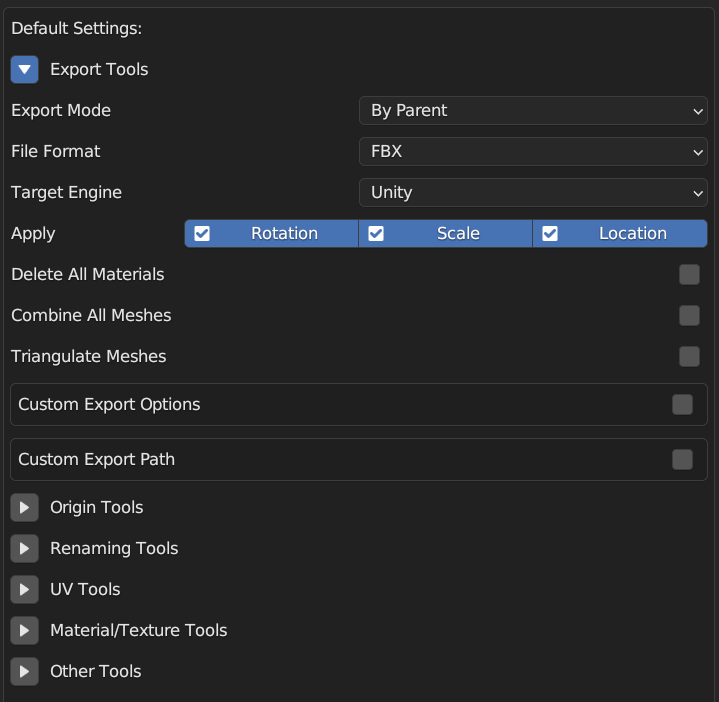
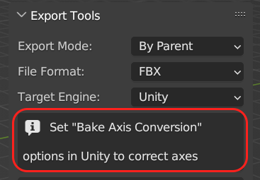
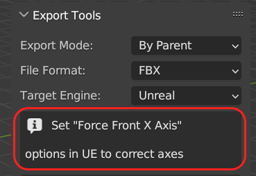
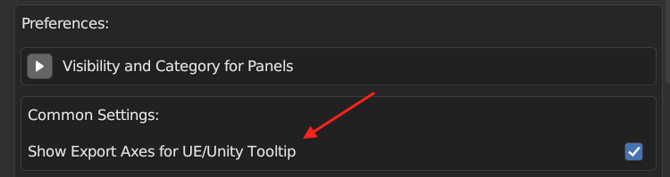
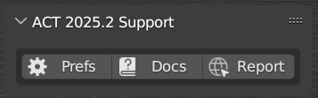

# ACT: Game Asset Creation Toolset Changelog

## ACT 2025.2.1

### Fix

* Preferences are not saved in JSON

## ACT 2025.2.0

### New

* #### Blender 5.0 Support
* #### Unified Zip for Blender 3.0 - 5.0 and higher

Do not understand which version of addon you need? You can download unified ZIP package for Blender 3.0+ and use it with any version of Blender. It's also compatible with Blender 5.0+.

* #### Default Settings in Preferences for addon properties

In Preferences window you can set default settings for the addon. These settings will be applied to new scene.

* #### Added Export Axes Tooltips for Unity/Unreal Target Engine

On Export Tools UI panel, tooltip is displayed about import parameters for Unity and UE to correct axes. 

Tooltip can be disabled in addon preferences.

* #### Added Support panel

Added panel with buttons for quick access to preferences, documentation and bug report. Support panel can be disabled in addon preferences.

### Changed

* #### [Export Tools][FBX][Unity] Scale for models in Unity is 1 

Models exported for Unity now use default scale of 1. Previously, the scale was 100, requiring manual adjustment in Unity’s import settings.

* #### [Export Tools][FBX] Rename Unity (Legacy) Target to Unity (Pre-Rotated)

The Unity (Legacy) target has been renamed to Unity (Pre-Rotated) for clearer and more concise description of the import method, which applies 90° pre-rotation on the X axis.

* #### [Export Tools] Export modes is reordered

Export modes reordered, the most commonly used options (By Parent and All-to-One) at the top of list now.

* Refactoring
* UI Improvements

### Fix

* [Material/Texture Tools] Error for Palette baking
* [Export Tools][Material/Texture Tools] "Open Folder" button on MacOS 
* Cycles panel error
* [Other Tools][Weight Paint] Brush invert for Mix blend
* [Preferences] Geometry panel category change is not working

## ACT 2025.1.0

### New

* #### Add/Remove LOD to Name

Add/replace/remove postfix _LOD* with a selected LOD level.

* #### Assign Seams from UV

Batch assignment of UV seams to models directly from Object Mode.

* #### Export Tool: Custom Scale and Axes for FBX/OBJ

* #### Cleanup Duplicated Materials

Remove duplicate materials (by name). Useful when importing many models with the same materials but from different files. In this case, Blender creates many copies of the materials. This function allows you to find and assign the original materials to all models.

* #### Select Objects with Negative Scale

In game development, objects with negative scale should be avoided (especially colliders or other physical objects). This tool allows you to find such objects.

* #### Cleanup Empties

Removing empty spaces under which there are no objects and meshes without geometry.

* #### Dissolve Checker Loops

Remove stitches one by one (starting from the selected edge). Perfect for simplifying cylindrical geometry.

* #### Collapse Checker Edges

Collapses edges one by one (along the loop). Perfect for simplifying spherical geometry.

### Changed

* Rename UV: Set Default name for UV when "Name" Field is empty

### Fix

* Fix addon installation error if Cycles is disabled
* Clear Custom Normals apply on meshes with custom normal data only

## Asset Creation Toolset 2024.2.0

### Fix

* Fix Unity FBX Export Orientation (Issue #30)
* Small Fixes

## Asset Creation Toolset 2024.1.0

### New 

* [New] Added only deform bones option for "Export FBX" (PR from @ani-kun)
* [New] Added Packing method for Add UV (Smart Projection or Lightmap UV)
* [New] Added GLTF Export (Request #28 from @maluramichael)
* [New] "Export FBX" now support of Custom Properties (Request #31 from @Anto775)

### Changed

* #### Update Authors

Added ani-kun to Co-authors.

### Removed

* Removed Import FBX/OBJ Feature (Blender can do this out of the box)

## Asset Creation Toolset 2023.2.0

### New

* [New] Added Link to Documentation

### Fix

* [Fix] "Create Palette Texture" doesn't work on Blender 4.0
* [Fix] OBJ Export doesn't work on Blender 4.0
* [Fix] OBJ Export Missing Options

## Asset Creation Toolset 2023.1.0

### New

* #### [New] New Export Algorithm for Unity (Fix Flip orientation, Linked Objects Support, Animation Support)
Now ACT has two different algorithms for export FBXs to Unity: "Unity" and "Unity (Legacy)".

**"Unity" Export Profile**

This profile supports Objects with Linked Data, more acurate for rigs, animations, angles and axis. But this export profile requires additional steps with models in Unity. You have to set in model import settings "Scale Factor" to 100 and check in option "Bake Axis Conversion".

For automatization this steps I created Unity Editor Script and you can use this different ways:

1. Select Models -> RMB -> ACT/Fix Models Transform.
2. Open ACT Settings Window (Window -> ACT -> Settings) and enable Models Postprocessor. It automatically set import settings for each model (or for models whose names contain the specified string or character).
The Unity editor ACT script is distributed with the ACT Blender add-on.

**"Unity" Export Profile**

But you can also use previous algorithm: This algorithm doesn't require additional actions in Unity and this Export Profile provide back-compatibility with already existing models.

* #### [New] Added feature "Origin to Middle Point" from @mokalux

New option for Align Origin: Move Origin to middle point between Min and Max Value. Thanks @mokalux for implementation!

* #### [New] Added feature "Collection Name -> Obj Name" from @Oxicid

Transfer Collection Name to Object Name. You can use dirrernt ways for that:

1. Added Collection name before or after current object name. For example, "CollectionName_ObjectName" or "ObjectName_CollectionName"
2. Replace Object Name to "Collection Name + Type + Numbering", For example, "CollectionName_Mesh_001" or "CollectionName_MESH_001". Thanks @Oxicid for implementation!

* #### [New] Added Replacing of invalid characters to "_" in export's name ([#%&{}<>*?/'":`|])

Invalid characters will replaced only in file name, not in object names. It very useful if you use special characters for naming.

* #### [New] Added Option "Combine All Meshes" for Export FBX/OBJ by parent/collection

"Combine All Meshes" option works now not only for "All->One FBX" Export.

* #### [New] Added Custom Export FBX Option "Add Leaf Bones". By default "Add Leaf Bones" option is disabled now.

* #### [New] Added Custom Export FBX Option "VC color space". By default VC color space is Linear now.

You can choose between "Linear" and "sRGB" color space for vertex color. I chose linear as default value because vertex color usually used for masking, but not as color information.

* #### [New] Added Debug Mode for tracking function execution time

Print function execuation time to console. For enabling this function enter to console bpy.context.scene.act.debug = True

### Changed

* #### [Improvement] Clean Up orphan mesh data after export FBX/OBJ or baking palette

"Export FBX/OBJ" and "Create Palette Texture" functions no more keep orphan mesh data in scene after use.

* #### [Improvement] Compact Preferences

* #### [Improvement] Merge Bones Improvements. Added support of multi-mesh rig

Yes, you can use this for rigs with multiple meshes. Also added more checks for avoid errors.

* #### [Improvement] Changed Version Numbering

This and next version will have contains current year and number of release in this year. For example, current release is 2023.1. I switched to a new version numbering so as not to confuse the addon version and the Blender version.

* #### [Improvement] Update Authors

Added mokalux and Oxicid to Co-authors.

* #### [Improvement] Update "Report a Bug" link

A button "Report Bug" in add-on preferences now open GitHub issues page. This is best way to report bug or suggest your enhansement. Welcome!

## Asset Creation Toolset 3.3.0

### Changed

* [Improvement] Correct Atlas material after baking palette texture. After baking creates materials with connected all baked maps
* [Improvement] Added commentaries for all code

### Fix

* [Fix] "Clear Vertex Colors" Error
* [Fix] "Merge Bones" Error

## Asset Creation Toolset 3.2.0

### New 

* [New][Create Palette Texture] Baking PBR Palettes. Now you can bake Color, Roughness, Metallic, Emission and Alpha from Principled BSDF
* [New]Export FBX/OBJ] OBJ Export Support
* [New]Export FBX/OBJ] Triangulate meshes before Export

### Changed

* [Improvement][Obj Name -> Data Name] "Obj Name -> Data Name" works with different object types (meshes, fonts, curves). Thanks for Felipe Torrents
* [Improvement][Export FBX/OBJ] Ignoring Modifier for Exported FBX/OBJ if modifier disabled for viewport or render

# Fix

* [Fix][Create Palette Texture] "Palette Baking" Error when UV Editor opened
* [Fix][Create Palette Texture] Baked Palette has black color if material has metallic value greater than 0

## Asset Creation Toolset 3.1.5

### Fix

* [Fix] Blender 2.93 Support
* [Fix] Correct detection of Blender Version

## Asset Creation Toolset 3.1.4

### Fix

* [Fix] Texture Palette Baking Error in Blender 2.92

## Asset Creation Toolset 3.1.3

### Fix

* [Fix][Export] Incorrect Rotation in Blender 2.92

## Asset Creation Toolset 3.1.2

### Changed

* [Improvement][Export] Added Support for Export Curves and Text to FBX

### Fix

* [Fix][Export] Trim names for Some Selected Objects
* [Fix][Export] Error Export Empties in Blender 2.90

## Asset Creation Toolset 3.1.1

### Fix

* [Fix] [Export FBXs] Incorrect Export FBX with modifiers in Blender 2.90

## Asset Creation Toolset 3.1.0

### New

* #### [New] [Weight Paint] Invert Weight Paint Brush

If use Add (or Subtract) Blending "Invert Brush" will switch Add/Subtract blending Mode. In another cases "Invert Brush" will invert Weight Value (for example, 0.2 - 0.8). You can Assign Shortcut for this function (RMB -> Assign Shortcut) (Recommended assign "X" key. This key is empty for Weight Paint and uses for Invert in many software).

* [New] [Viewport Color] Random Material Viewport Color
* [New] [Viewport Color] Clear Material Viewport Color (Return Default Light Grey Color)
* [New] [Palette Texture] Saving Palette Texture after Baking (as in "Export FBX Tool")

# Fix

* [Fix] [Palette Texture] Image Editor Window switched to Console if opened several Image Editor Windows
* [Fix] [Export FBX] Error when Exported Object has "incorrect" Modifier (red highlighted)

## Asset Creation Toolset 3.0.1

### Fix

* [Fix] [Export] Incorrect Export by Collection

## Asset Creation Toolset 3.0.0

### New

* [New] [Textures] Quick Select Texture from Active material in UV Editor
* [New] [UI/UX] Show/Hide UI Panels via Addon Preferences
* [New] [UI/UX] Changing Category for each Panel from Preferences
* [New] [UV] Add UV Layer to Selected Objects with Custom Name
* [New] [UV] Remove UV Layer from Selected Objects by UV Index
* [New] [UV] Set Active UV Layer for Selected Objects in 3D View and Image/UV Editor by UV Index
* [New] [Import] Custom Import Options: Import Custom Normals (FBX)/Smooth Groups (OBJ), Import Animation, Automatic Bone Orientation, Import Leaf Bones
* [New] [Export] Combine All Meshes Option for "All -> One FBX" Export Mode

### Changed

* [Improvement] [Export] Correct Export with Modifiers
* [Improvement] [Export] Correct Export Linked objects (with Shared Mesh Data)
* [Improvement] [Export] Don't Applying Transforms on objects before Export
* [Improvement] [Create Palette Texture] Automatic change render enging before and after baking
* [Improvement] [Logic] Refactoring of Code - Unified Variables Names, Multi File Structure of Addon
* [Improvement] [UI/UX] Improvements of UI/UX. Reorganizing UI Panels
* [Improvement] [UI/UX] Hide "UV Mover" Panel if current mode is not Edit Mesh

### Fix

* [Fix] [Export] Check Dir Existing for "Open Export Folder"
* [Fix] [Create Palette Texture] Baking creates materials with same name
* [Fix] [Create Palette Texture] Error with automatic creating/deleting temporary material Palette_Bake
* [Fix] [Merge Bones] Merge Bones Error if Armature has no Mesh

## Asset Creation Toolset 2.6.1

### New

* [New] Added Export FBX to Unreal Engine

## Asset Creation Toolset 2.6.0

### New

* [New] Merge Bones. Tool For Easy Simplifying Armature: Delete (or Dissolve) Selected Bones (Exclude Active) and Transfer Vertex Weights to Active Bone
* [New] "Material -> Viewport Color" - Transfer Material Base Color to Viewport Color for Solid View Mode

### Changed

* [Improvement] "Delete Unused Materials" is Back!
* [Improvement] Added Custom Export Options (Smoothing, Tangent Space, Apply Modifiers and Loose Edges)

### Fix
* [Fix] Active Material -> Selected Attach Active Material to All Selected Objects, Not only to Objects with Selected Faces
* [Fix] Wrong Numbering If Change Axis and Set Numbering Again

## Asset Creation Toolset 2.5.0

### New

* [New] New Option for Export FBX's by Parent - "Apply Rotation - Apply for Rotated Objects". If Objects in exported FBX have any rotation for this fbx will be not apply rotations. In other words, if all objects in exported hierarchy have rotation (0, 0, 0) then apply rotation for this FBX, else Rotation will not applyed.
* [New] Added new export FBX's mode - By Collection.
* [New] New Option for Export FBX's - Delete All Materials before Export.
* [New] Added button "Open Export Directory". Open Folder with exported FBX's in OS (Tested on Windows 10, Linux Mint 19.2, XUbuntu 18.04).
* [New] Added button "Delete Unused Materials". Delete from selected objects unused materials (not applyed to faces) and unused material slots.
* [New] Added Button "Active Material -> Selected" for assignment active material to selected faces in MultiEdit Mode
* [New] Quick add postfixes .L and .R to Selected Bones.

### Changed

* [Improvement] Now can export fbx's to custom folder without saving blend-file

### Fix

* [Fix] Export FBX's: After export some objects have rotation -90 degrees in hierarchy parent-child
* [Fix] Error if enabled "Custom Name FBX" and Name-field is empty

