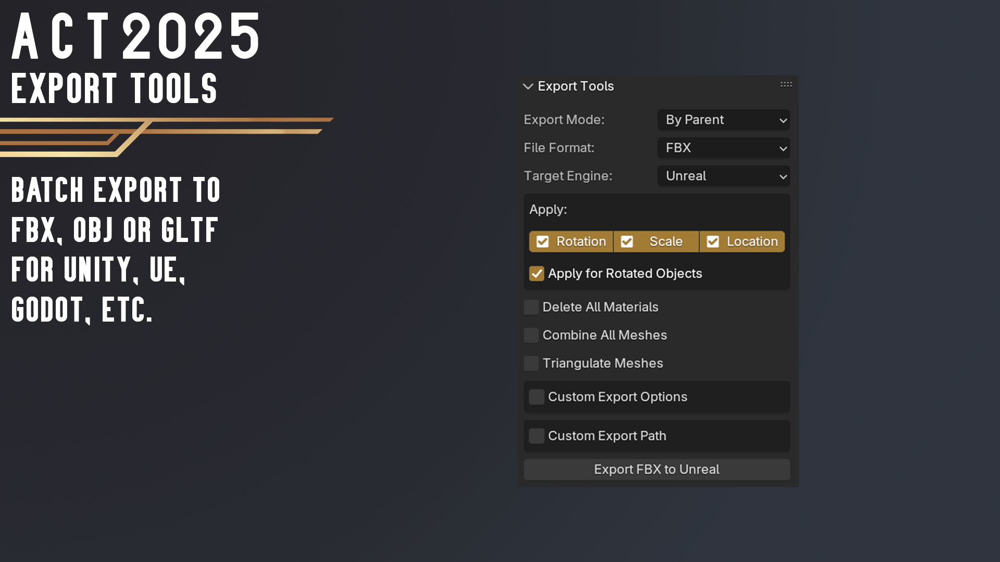
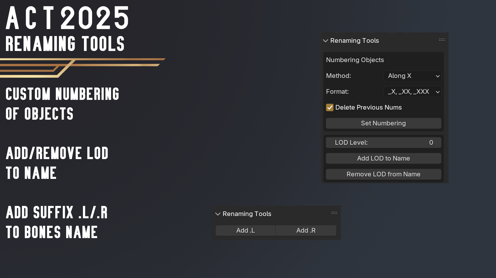
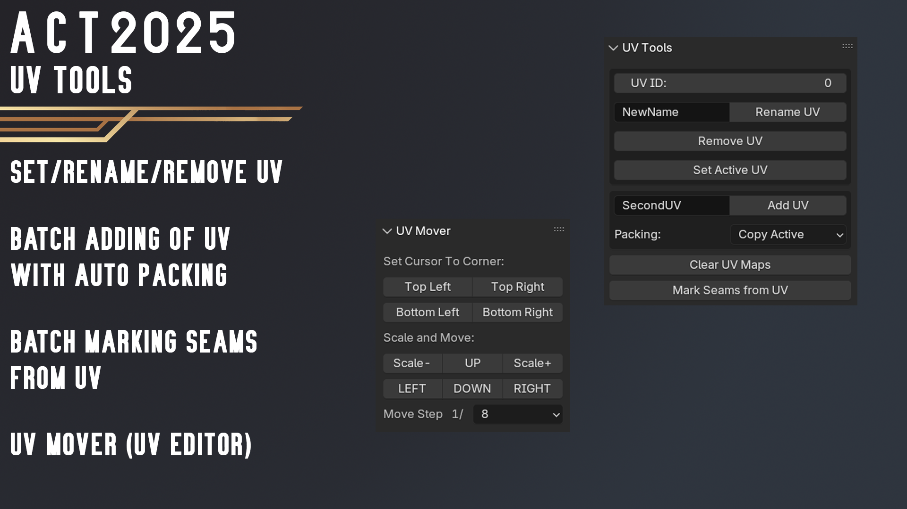
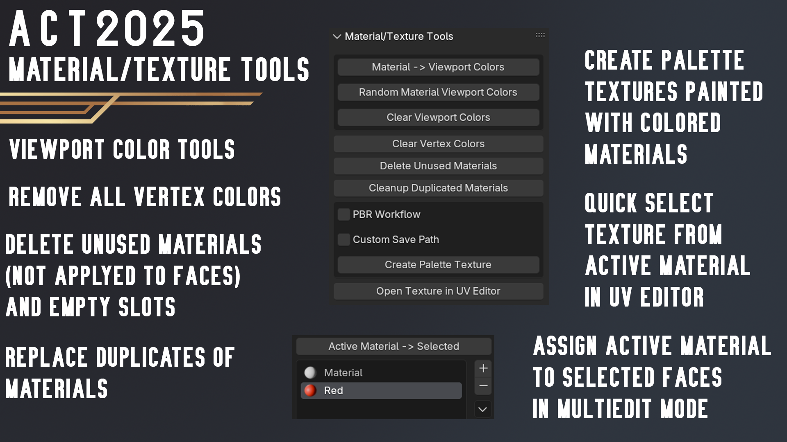

# Blender Addon: ACT: Game Asset Creation Toolset

**ACT** is Many Tools for Game Asset Creation (Batch Export FBXs/GLTF for Unity/UE/Godot, Origin Aligment Tool, Renaming, UV Tools, Low-Poly Art workflow tools, etc.) for Blender.

## ***Download latest version:***
* ***[(2025.2) Blender 4.2+ (from Blender Extensions)](https://extensions.blender.org/add-ons/act-game-asset-creation-toolset/)***
* ***[(2025.2) Blender 3.0++ (even 5.0+)](https://github.com/mrven/Blender-Asset-Creation-Toolset/raw/master/Releases/ACT_2025_2_0.zip)***
* ***[(3.1.5) Blender 2.9+](https://github.com/mrven/Blender-Asset-Creation-Toolset/raw/master/Releases/Asset_Creation_Toolset_3_1_5_290.zip)***
* ***[(3.1.2) Blender 2.83+](https://github.com/mrven/Blender-Asset-Creation-Toolset/raw/master/Releases/Asset_Creation_Toolset_3_1_2_283.zip)***
* ***[(2.4.1) Blender 2.79](https://github.com/mrven/Blender-Asset-Creation-Toolset/raw/master/Releases/Asset_Creation_Toolset_2_4_1_279.zip)***

If you want to support me you can buy this addon:
* ***[Superhive](https://superhivemarket.com/products/act)***
* ***[Gumroad](https://mrven.gumroad.com/l/hPXIh)***

## What's new in ACT 2025?

#### New

* Unified Zip for Blender 3.0 - 5.0 and higher
* Default Settings in Preferences for addon properties
* Added Export Axes Tooltips for Unity/Unreal Target Engine
* Added Support panel
* Add/Remove LOD to Name
* Assign Seams from UV
* Export Tool: Custom Scale and Axes for FBX/OBJs
* Cleanup Duplicated Materials
* Select Objects with Negative Scale
* Cleanup Empties
* Dissolve Checker Loops
* Collapse Checker Edges

#### Changed

* Export Tools: Scale for models in Unity is 1 for Unity FBX
* Export Tools: Rename Unity (Legacy) Target to Unity (Pre-Rotated)
* Export Tools: Export modes is reordered
* Rename UV: Set Default name for UV when "Name" Field is empty

#### Fix

* Palette Bake: Error for Palette baking
* Export Tools: "Open Folder" button on MacOS 
* Weight Paint: Brush invert for Mix blend
* Preferences: Geometry panel category change is not working
* Addon error for Cycles panel register/unregister
* Clear Custom Normals apply on meshes with custom normal data only

[See full CHANGELOG](CHANGELOG.md#act-202520)

## Documentation

[Install Addon](./docs/install_addon.md)

[Support Panel](./docs/support_panel.md)

[Export Tools](./docs/export_tools.md)

[Origin Tools](./docs/origin_tools.md)

[Renaming Tools](./docs/rename_tools.md)

[UV Tools](./docs/uv_tools.md)

[Material/Texture Tools](./docs/material_tools.md)

[Geometry Tools](./docs/geometry_tools.md)

[Other Tools](./docs/other_tools.md)

[Addon Preferences](./docs/preferences.md)

[How to report a bug?](./docs/bug_report.md)

## Features Overview

