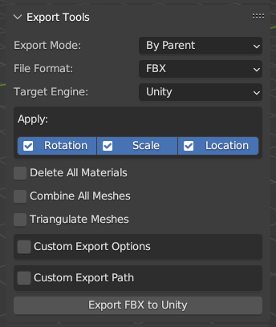
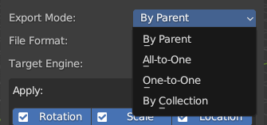
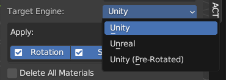
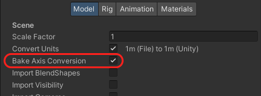

[<< Return to README](../README.md#documentation)

# Export Tools

Batch Export Selected Objects to OBJ/FBX/GLTF for Unity, UE or Godot. 

## Export Mode

* **By Parent** - Batch Objects by Parent (Each parent with children -> separate files)
* **All-to-One** - Export All Selected Object into One file
* **One-to-One** - Export Each Object into Individual file
* By Collection - Batch Objects by Collection

## Target Engine (for FBX)

You can export FBX for Unity or Unreal Engine.

### Export Algorithms for Unity

ACT has two different algorithms for export FBXs to Unity: ***"Unity"*** and ***"Unity (Pre-Rotated)"***.
s
#### "Unity" Export Profile

This profile supports Objects with Linked Data, more accurate for rigs, animations, angles and axis. ***But this export profile requires additional steps with models in Unity.*** You have to enable in model import settings option "Bake Axis Conversion".

#### "Unity (Pre-Rotated)" Export Profile

This algorithm rotate geometry for each object 90 degrees by X Axis for correct axes in Unity. This algorithm doesn't require additional actions in Unity, but has some limitations (doesn't support multi-users, animations, etc.).