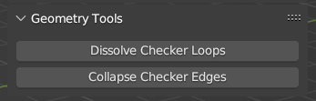

[<< Return to README](../README.md#documentation)

# Geometry Tools

## Dissolve Checker Loops
Remove stitches one by one (starting from the selected edge). Perfect for simplifying cylindrical geometry.

## Collapse Checker Edges
Collapses edges one by one (along the loop). Perfect for simplifying spherical geometry.