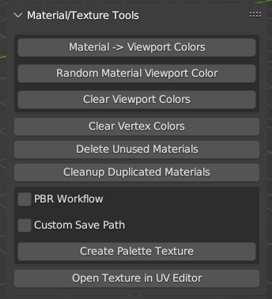
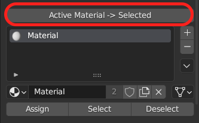

[<< Return to README](../README.md#documentation)

# Material/Texture Tools

## Material -> Viewport Color / Random Material Viewport Colors

Transfer Material Base Color to Viewport Color for Solid View Mode. Or Generate Random Colors for Materials for Viewport.

## lear Vertex Color

Just remove all Vertex Colors from selected objects.

## Delete Unused Materials

Delete from selected objects unused materials (not applyed to faces) and unused material slots.

## Create Palette Textures (Albedo, Roughness, Metallic, Opacity and Emission)

Create Palette Textures (32x32px) for Selected Objects painted with colored materials. In one palette texture can be up to 256 colors (materials).

## Quick Select Texture from Active material in UV Editor

## Cleanup Duplicated Materials

Remove duplicate materials (by name). Useful when importing many models with the same materials but from different files. In this case, Blender creates many copies of the materials. This function allows you to find and assign the original materials to all models.

## Active Material -> Selected

Assign active material to selected faces in MultiEdit Mode.
