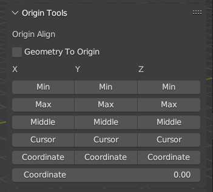
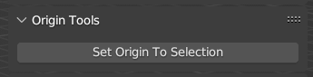

[<< Return to README](../README.md#documentation)

# Origin Tools

## Origin Align Tool

Alignment Origin Point to:
* Max/Min/Middle point of object for X, Y or Z axis
* 3D Cursor (Separate Axis)
* Coordinates (Separate Axis)

## Set Origin to Selected (Edit Mode)

Set Origin Point to Selected Element(s)