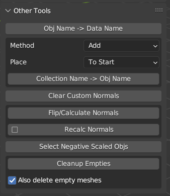
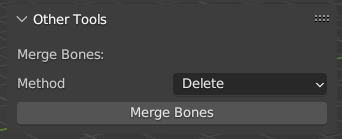
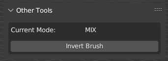

[<< Return to README](../README.md#documentation)

# Other Tools

## Obj Name -> Data Name

Copy Object Name to Mesh/Font/Etc.(Data-Block) Name.

## Collection Name -> Obj Name

Transfer Collection Name to Object Name. You can use dirrernt ways for that:
1. Added Collection name before or after current object name. For example, ***"CollectionName_ObjectName"*** or ***"ObjectName_CollectionName"***
2. Replace Object Name to "Collection Name + Type + Numbering", For example, ***"CollectionName_Mesh_001"*** or ***"CollectionName_MESH_001"***. Thanks @Oxicid for implementation!

## Clear Custom Normals

Clear Custom Normals and set Autosmooth to 180 degrees for Selected Objects.

## Flip/Calculate Normals

Flip or Recalculate Normals for Selected Objects in Object Mode.

## Select Objects with Negative Scale

In game development, objects with negative scale should be avoided (especially colliders or other physical objects). This tool allows you to find such objects.

## Cleanup Empties

Removing empty spaces under which there are no objects and meshes without geometry.

## Merge Bones Tool

Tool For Easy Simplifying Armature: Delete (or Dissolve) Selected Bones (Exclude Active) and Transfer Vertex Weights to Active Bone.

## Invert Weight Paint Brush

If You use Add (or Subtract) Blending "Invert Brush" will switch Add/Subtract blending Mode. In another cases "Invert Brush" will invert Weight Value (for example, 0.2 - 0.8). You can Assign Shortcut for this function (RMB -> Assign Shortcut) (Recommended assign "X" key. This key is empty for Weight Paint and uses for Invert in many software).