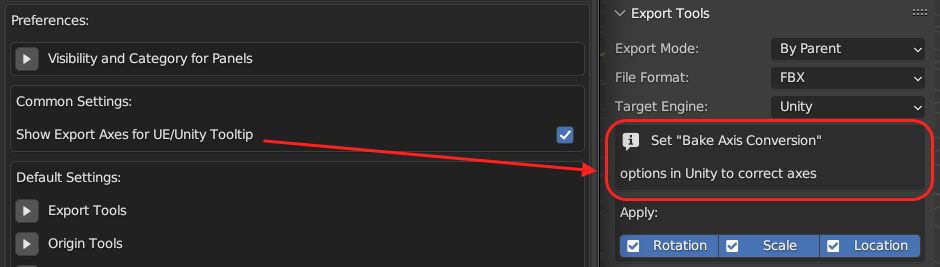

[<< Return to README](../README.md#documentation)

# Addon Preferences

ACT preferences window with following options:
* Show Export Axes Tooltip
* Default Settings

## Show Export Axes Tooltip

Show or Hide Tooltip about axes in Export Tools panel.

## Default Settings

Default settings for ACT, which will be applied to all new scenes.

### Copy Default Settings To Current Session

Copy default settings to current Blender session.

## Reset Preferences

Reset all preferences to default values.