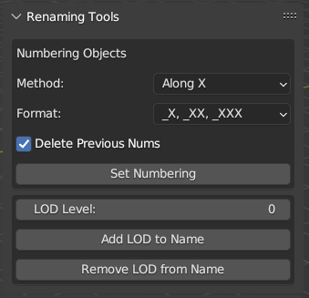
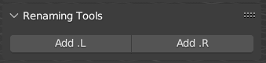

[<< Return to README](../README.md#documentation)

# Renaming Tools

## Numbering Objects

Delete Blender's default numbering and add new numbering by Axis/Outliner order with pattern:
* xxx_1, xxx_10, xxx_100
* xxx_01, xxx_10, xxx_100
* xxx_001, xxx_010, xxx_100

## Add/Remove LOD to Name

Add/replace/remove postfix \_LOD\* with a selected LOD level.

## Add .L or .R suffix to Bones

Quick add suffix .L or .R to Selected Bones.