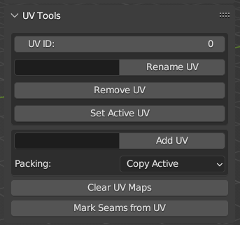
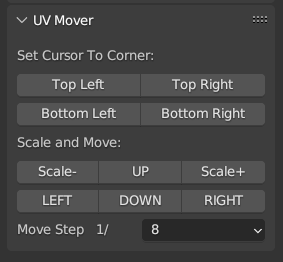

[<< Return to README](../README.md#documentation)

# UV Tools

* Batch Renaming UV by Index (example, Lightmap - second uv channel)
* Batch Add UV with custom name (copy UV from active, smart projection or lightmap uv)
* Batch Remove UV by Index
* Set Active UV Layer for Selected Objects in 3D View and Image/UV Editor by UV Index

## Mark Seams from UV

Batch assignment of UV seams to models directly from Object Mode.

## UV Mover (UV Image Editor)

Tool for easier Atlas Packing.
* Scale UV with power of 2
* Move UV with steps